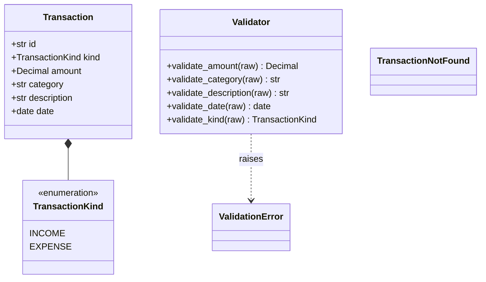
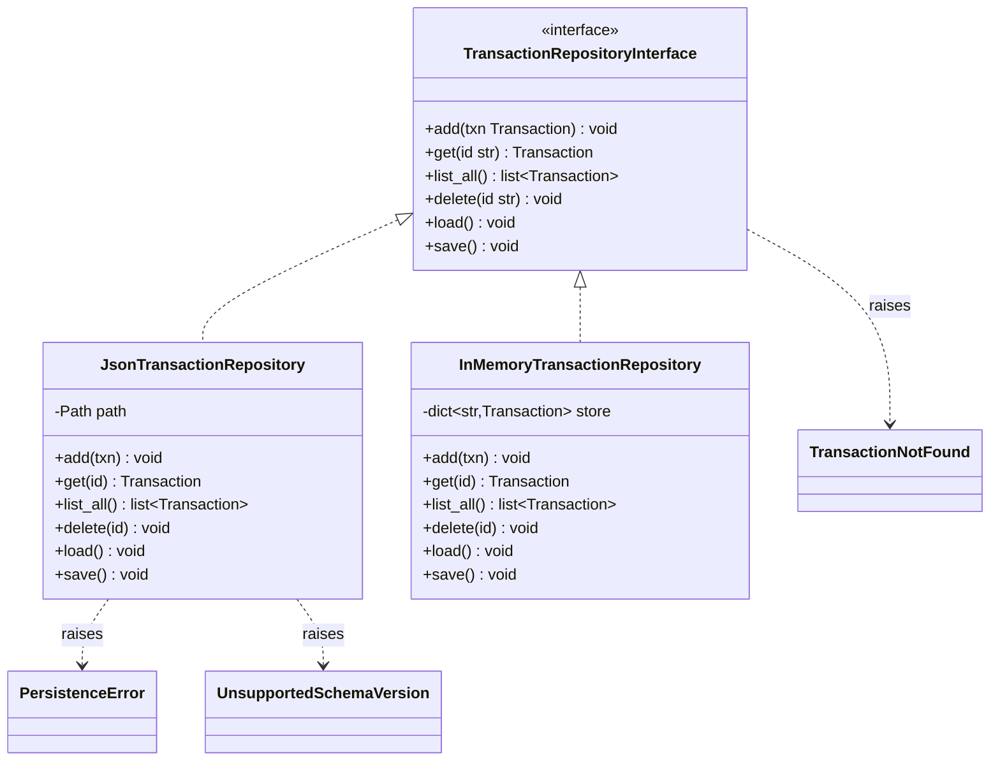
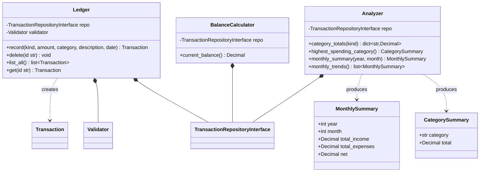
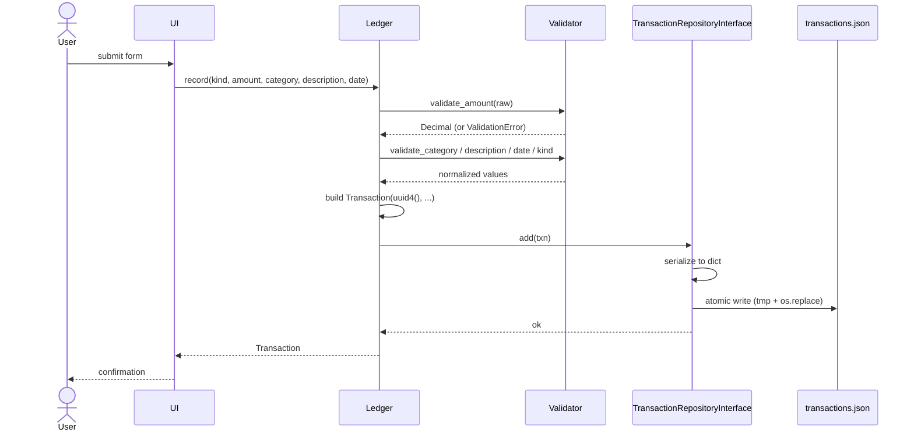
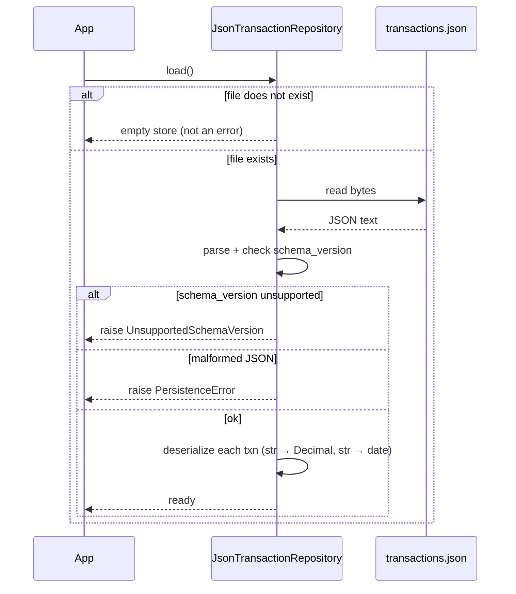

# Personal Finance Tracker

A standalone Python application for recording income and expenses, categorizing spending, and calculating account balances. Data is persisted locally as JSON.

This project is built for a Software Verification and Testing course. The architecture is deliberately layered to maximize testability: each module can be exercised in isolation through clean abstract seams.

## Table of Contents

- [Features](#features)
- [Architecture Overview](#architecture-overview)
- [Why the Repository Pattern?](#why-the-repository-pattern)
- [Class Diagrams (UML)](#class-diagrams-uml)
- [Runtime Flow](#runtime-flow)
- [Data Store Schema](#data-store-schema)
- [Design Decisions](#design-decisions)
- [Team](#team)

## Features

| ID | Capability | Owner |
|----|------------|-------|
| F1 | Record transactions (income / expense) | Mustafa |
| F2 | View / retrieve transactions | Owais |
| F3 | Calculate current balance | Owais |
| F4 | Delete transaction by ID | Owais |
| F5 | Persist to / load from local JSON | Mustafa |
| F6 | Validate user input | Anas |
| F7 | User interface | Anas |
| F8 | Analyze — category summaries, monthly trends, highest-spending category | Mohd Karim |

## Architecture Overview

The system uses a **layered architecture with dependency injection**. The boundaries between layers are the primary testing seams.

```
┌─────────────────────────────────────────────┐
│  UI Layer                         (F7)      │
│  - Forms, display, user interaction         │
├─────────────────────────────────────────────┤
│  Application Layer  (public API)            │
│  - Ledger                     (F1, F2, F4)  │
│  - BalanceCalculator              (F3)      │
│  - Analyzer                       (F8)      │
├─────────────────────────────────────────────┤
│  Domain Layer  (pure, no I/O)               │
│  - Transaction, TransactionKind             │
│  - Validator                      (F6)      │
│  - Custom exceptions                        │
├─────────────────────────────────────────────┤
│  Repository Layer  (storage abstraction)    │
│  - TransactionRepositoryInterface (ABC)     │
│    ├─ JsonTransactionRepository   (F5)      │
│    └─ InMemoryTransactionRepository (tests) │
└─────────────────────────────────────────────┘
```

**Key principle:** higher layers depend only on abstractions from lower layers. The application layer does not import `json` or touch the filesystem — it operates on the `TransactionRepositoryInterface`. This lets every application-level test run against an in-memory repository with zero I/O.

**Naming convention:** classes use PascalCase (per PEP 8). Abstract base classes / interfaces carry an `Interface` suffix (e.g. `TransactionRepositoryInterface`). Concrete implementations do not.

## Why the Repository Pattern?

The `TransactionRepositoryInterface` is the single most load-bearing architectural choice in this design, so it's worth explaining clearly.

### The problem it solves

If `Ledger`, `BalanceCalculator`, and `Analyzer` all directly read and write `transactions.json`, then:

- Every unit test has to set up a real JSON file on disk, even tests that only care about balance math.
- Any change to the storage format (adding a field, switching to SQLite later) requires editing every class that touches the file.
- It's impossible to test "what happens when the file is corrupted" without actually corrupting a file on disk.
- Tests are slow (file I/O) and flaky (filesystem state leaks between tests).

### What the Repository pattern is

An **interface** that describes *what you can do* with a collection of transactions — without saying *how* those transactions are stored:

```
TransactionRepositoryInterface:
    add(txn)
    get(id)
    list_all()
    delete(id)
    load()
    save()
```

Every class that needs transactions takes a `TransactionRepositoryInterface` as a constructor argument. They don't care — and can't tell — whether the implementation is backed by JSON, SQLite, a remote API, or a Python dict.

### The two implementations

- **`JsonTransactionRepository`** — the real one. Reads and writes `transactions.json`. Handles atomic writes, schema versioning, serialization, the lot.
- **`InMemoryTransactionRepository`** — a Python dict wrapped in the same interface. Zero I/O. Used only in tests.

Because `Ledger` holds a `TransactionRepositoryInterface`, not a `JsonTransactionRepository` (the concrete class), a test can construct a `Ledger` with the in-memory version in one line — and all `Ledger` tests run in milliseconds with no filesystem involvement.

### How it maps to testing

| Test of... | Uses this repository | Reason |
|------------|---------------------|--------|
| `Ledger.record` logic | In-memory | We're testing the ledger's behavior, not file I/O |
| `BalanceCalculator` math | In-memory | F3 adverse conditions are easier to set up in memory |
| `Analyzer` aggregations | In-memory | Seed it with exactly the transactions the test needs |
| `JsonTransactionRepository` itself | Real file in `tmp_path` | This is the class whose *job* is file I/O |
| End-to-end system test | Real file | Validates the whole stack |

This is sometimes called **dependency inversion**: the high-level policy (`Ledger`) doesn't depend on the low-level detail (JSON files). They both depend on an abstraction (`TransactionRepositoryInterface`). It's one of the main reasons the design is testable at all.

### What it costs

- One extra file (the interface definition) — maybe 20 lines of Python.
- One extra class per implementation — the `InMemoryTransactionRepository` is ~30 lines.
- Callers have to pass the repository in rather than reaching for a global.

For a testing-focused course project, this is a very cheap price for a clean testing seam.

## Class Diagrams (UML)

Split into three focused views to stay readable. UML conventions used: `<|..` realization (implementing an interface), `*--` composition (owned reference held as a field), `..>` dependency (transient use — parameter, local, raises).

### Domain model

Pure data types and the validator. No I/O, no dependencies on anything else in the system.



### Repository

The persistence abstraction and its two implementations. This is the only layer that touches JSON or the filesystem.



### Application layer

The three top-level classes the UI talks to, plus the small result DTOs produced by `Analyzer`. Each class is composed over a `TransactionRepositoryInterface` so tests can swap in the in-memory implementation.



## Runtime Flow

### Recording a transaction (F1)



### Loading on startup (F5)



## Data Store Schema

The application persists its state to a single JSON file (default: `transactions.json`). The file is rewritten atomically on every save (write to `.tmp`, then `os.replace`) so an interrupted write cannot corrupt the existing store.

### Top-level envelope

```json
{
  "schema_version": 1,
  "transactions": [ ... ]
}
```

| Field | Type | Purpose |
|-------|------|---------|
| `schema_version` | integer | Guards forward/backward compatibility. A loader that sees an unknown version raises `UnsupportedSchemaVersion` rather than misinterpreting data. |
| `transactions` | array | Flat, unordered list of transaction objects. |

A missing file is treated as an empty store. A present file that fails to parse raises `PersistenceError` — the application never silently resets user data.

### Transaction object

```json
{
  "id": "550e8400-e29b-41d4-a716-446655440000",
  "kind": "expense",
  "amount": "42.50",
  "category": "food",
  "description": "Groceries at Trader Joe's",
  "date": "2026-04-27"
}
```

| Field | Type | Format / Constraints |
|-------|------|----------------------|
| `id` | string | UUID v4, generated server-side. Callers do not supply IDs. |
| `kind` | string | Exactly `"income"` or `"expense"`. |
| `amount` | string | Decimal amount serialized as a string. Always positive. Parsed into `decimal.Decimal` in memory. |
| `category` | string | Non-empty. Validated against the allowed category set at the domain layer, not in storage. |
| `description` | string | Non-empty, trimmed. |
| `date` | string | `YYYY-MM-DD`, the real-world date of the transaction (user may backdate). |

### Why `amount` is a string

JSON numbers are parsed into Python `float`, which loses precision (`0.1 + 0.2 != 0.3`). Storing the amount as a string lets us round-trip through `decimal.Decimal` losslessly, which is what the F3 balance calculation and the "large value handling" adverse-condition test require.

### Why `kind` is separate from the sign of `amount`

Amounts are always positive. Direction is explicit via `kind`. This simplifies validation (one rule: `amount > 0`) and makes the balance computation read naturally as `sum(income) - sum(expense)`, with each branch independently testable.

### Example file

```json
{
  "schema_version": 1,
  "transactions": [
    {
      "id": "550e8400-e29b-41d4-a716-446655440000",
      "kind": "income",
      "amount": "2500.00",
      "category": "salary",
      "description": "April paycheck",
      "date": "2026-04-15"
    },
    {
      "id": "7c9e6679-7425-40de-944b-e07fc1f90ae7",
      "kind": "expense",
      "amount": "42.50",
      "category": "food",
      "description": "Groceries at Trader Joe's",
      "date": "2026-04-27"
    }
  ]
}
```

## Design Decisions

Each decision below lists the tradeoff and the testability justification, since testability is the primary concern of the course.

### D1. `Decimal` for money, never `float`
`float` cannot represent common decimal values exactly. Using `decimal.Decimal` end-to-end makes arithmetic exact and makes F3's "large value handling" adverse condition trivial. `Decimal` is never constructed from a `float` — only from a string or int — and this rule is itself a validator with a dedicated unit test.

### D2. Amounts serialized as strings
Prevents the JSON parser from silently converting amounts to `float`. The repository layer is the only place that converts between the on-disk string form and the in-memory `Decimal` form, and the round trip is covered by a single symmetric test: `deserialize(serialize(txn)) == txn`.

### D3. `kind` + positive amount (not signed amount)
Keeps validation rules independent (`amount > 0`, `kind ∈ {income, expense}`) and makes the balance formula read as two clearly testable branches.

### D4. Immutable transactions (no edit operation)
The proposal specifies Record and Delete only. No `updated_at`, no mutation path. Removing mutation removes an entire category of potential bugs and untested code paths.

### D5. Server-side UUIDs
IDs are generated inside the `Ledger`, not supplied by callers. Callers cannot cause collisions, and tests can assert that the returned transaction has a valid UUID without depending on a specific value (inject a fake UUID factory if determinism is needed for a specific test).

### D6. Repository as an abstract interface
`TransactionRepositoryInterface` is an ABC; `JsonTransactionRepository` is the production implementation and `InMemoryTransactionRepository` is the test implementation. Application-layer tests run against the in-memory repository with zero file I/O, while the JSON repository gets its own focused persistence tests using `tmp_path`.

### D7. Atomic writes
Every save writes to a temp file then uses `os.replace` for an atomic rename. A crash mid-write leaves the previous valid file untouched. This is both a correctness guarantee and a testable behavior (simulate crash between write and rename, verify original file is intact).

### D8. `schema_version` from day one
Even at v1, the loader actively checks the version and raises `UnsupportedSchemaVersion` for anything else. This is one `if` and one unit test, and it makes a future migration a controlled change rather than a breaking one.

### D9. Custom exception hierarchy
`TransactionNotFound`, `ValidationError`, `PersistenceError`, `UnsupportedSchemaVersion`. Distinct types let tests assert on the *reason* a call failed, not just that it failed. Generic `ValueError` / `KeyError` are avoided at API boundaries.

### D10. Injected clock and filesystem path
The repository takes its target path via the constructor, and any class that needs the current time takes a `datetime_provider` callable. Tests can freeze time and redirect I/O without monkey-patching.

### D11. `Validator` lives in the domain layer
Input validation (F6) is implemented as pure functions in the domain layer, reused by both the UI and the application layer. Validation is therefore testable without standing up a UI harness, and the UI cannot be the only line of defense.

### D12. Verb-based class names (no `Service` suffix)
Classes are named for what they *do*: `Ledger` records and retrieves, `BalanceCalculator` calculates, `Analyzer` analyzes, `Validator` validates. Avoids the generic "Service" suffix that obscures responsibility, and keeps the API readable: `ledger.record(...)` reads more naturally than `transaction_service.record(...)`.

## Team

| Team Member | Role | Features Owned |
|-------------|------|----------------|
| Mustafa Siddiqui | Backend Architect & Developer | F1 (Record), F5 (Persist), schema & backend API design |
| Owais Adil Mohammed | Core Backend Developer | F2 (View), F3 (Balance), F4 (Delete) |
| Anas Rais Lnu | Security & UI Specialist | F6 (Validation), F7 (Interface) |
| Mohd Karim Siddiqui | Reporting & Analytics Developer | F8 (Analyze — summaries, trends, category insights) |

## Scope and Future Improvements

v1 keeps the surface deliberately small so that testing effort is concentrated on correctness, not on combinatorial query options.

**In scope for v1**
- All F8 analytics operate over the **entire set of recorded transactions**. No date-range filtering, no per-category filtering at the API level.
- Single personal account, single currency.
- Immutable transactions (record and delete only, no edit).

**Deferred to future versions**
- Date-range filters on analytics queries (e.g. `category_totals(start, end)`, `monthly_trends(start, end)`).
- Multi-account support.
- Multi-currency support.
- Editing existing transactions.
- Budget targets and alerts.

These are explicitly out of scope for v1 so that the schema and service contracts remain stable while the team focuses on testing the core features end-to-end.
