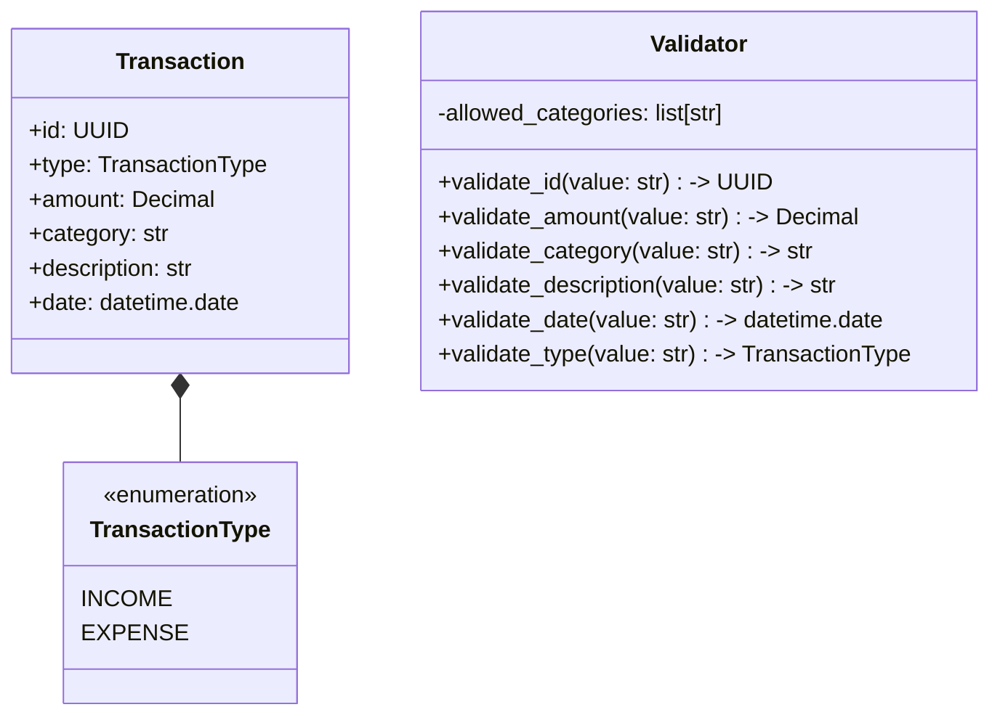
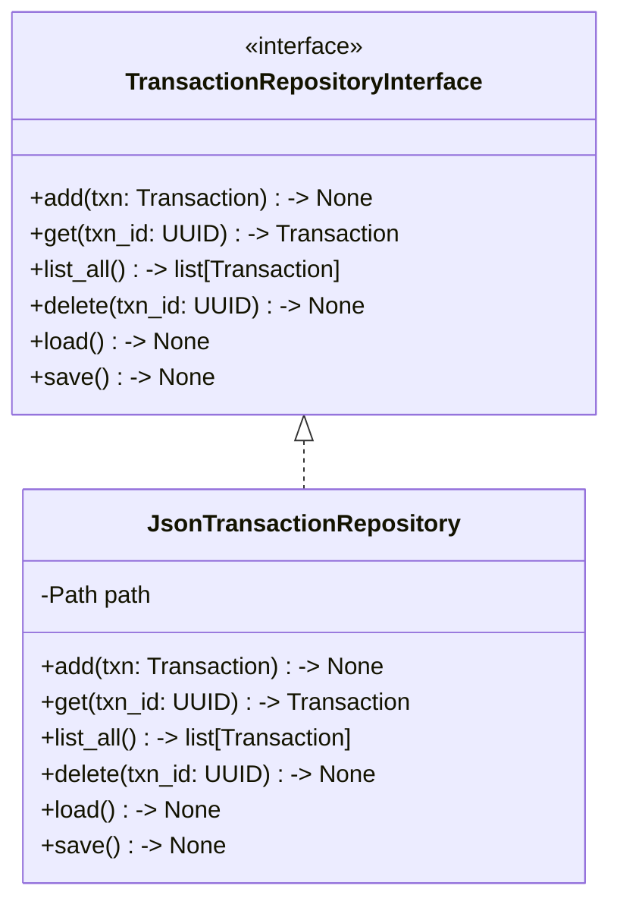
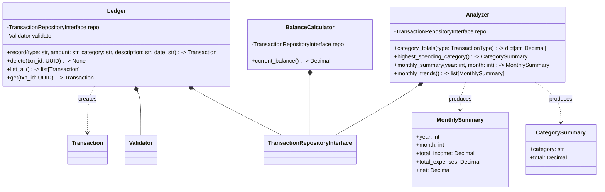
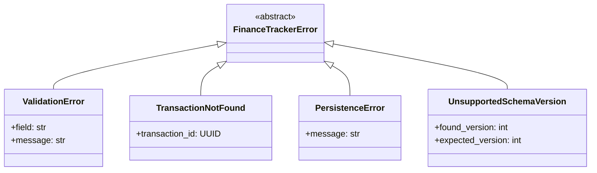
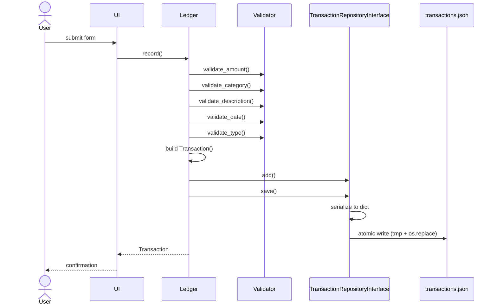
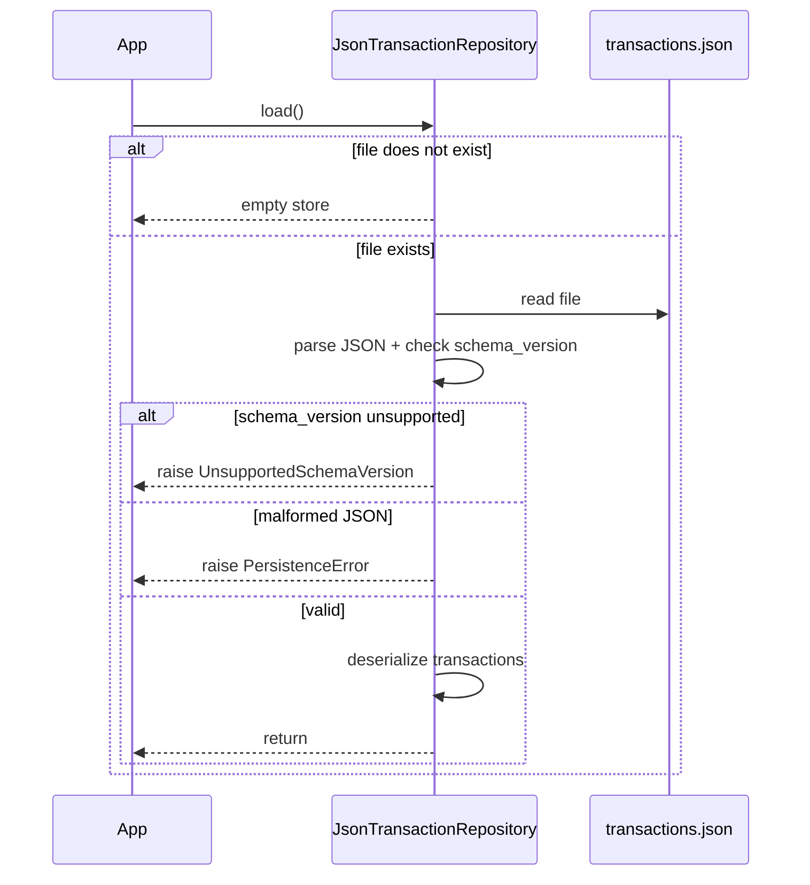

# Personal Finance Tracker

A standalone Python application for recording income and expenses, categorizing spending, and calculating account balances. Data is persisted locally as JSON.

This project is built for a Software Verification and Testing course. The architecture is deliberately layered to maximize testability: each module can be exercised in isolation through clean abstract seams.

## Table of Contents

- [Features](#features)
- [Architecture Overview](#architecture-overview)
- [Persistence Abstraction](#persistence-abstraction)
- [Class Diagrams (UML)](#class-diagrams-uml)
- [Exception Hierarchy](#exception-hierarchy)
- [Runtime Flow](#runtime-flow)
- [Data Store Schema](#data-store-schema)
- [Design Decisions](#design-decisions)
- [Team](#team)
- [Scope and Future Improvements](#scope-and-future-improvements)

## Features

| ID | Capability | Owner |
|----|------------|-------|
| F1 | Record transactions (income / expense) | Mustafa |
| F2 | View / retrieve transactions | Owais |
| F3 | Calculate current balance | Owais |
| F4 | Delete transaction by ID | Owais |
| F5 | Persist to / load from local JSON | Mustafa |
| F6 | Validate user input | Anas |
| F7 | User interface | Anas |
| F8 | Analyze — category summaries, monthly trends, highest-spending category | Mohd Karim |

## Architecture Overview

The system uses a **layered architecture with dependency injection**. The boundaries between layers are the primary testing seams.

```
┌─────────────────────────────────────────────┐
│  UI Layer                         (F7)      │
│  - Forms, display, user interaction         │
├─────────────────────────────────────────────┤
│  Application Layer  (public API)            │
│  - Ledger                     (F1, F2, F4)  │
│  - BalanceCalculator              (F3)      │
│  - Analyzer                       (F8)      │
├─────────────────────────────────────────────┤
│  Domain Layer  (pure, no I/O)               │
│  - Transaction, TransactionType             │
│  - Validator                      (F6)      │
│  - Custom exceptions                        │
├─────────────────────────────────────────────┤
│  Repository Layer  (storage abstraction)    │
│  - TransactionRepositoryInterface (ABC)     │
│    └─ JsonTransactionRepository   (F5)      │
└─────────────────────────────────────────────┘
```

## Persistence Abstraction

Higher layers depend only on abstractions from lower layers.
The application layer does not import `json` or touch the filesystem — it operates on the `TransactionRepositoryInterface`.
This lets unit tests mock the repository to isolate application logic from I/O.

If `Ledger`, `BalanceCalculator`, and `Analyzer` all directly read and write `transactions.json`, then:

- Every unit test has to set up a real JSON file on disk, even tests that only care about balance math.
- Any change to the storage format (adding a field, switching to SQLite later) requires editing every class that touches the file.
- It's impossible to test "what happens when the file is corrupted" without actually corrupting a file on disk.
- Tests are slow (file I/O) and flaky (filesystem state leaks between tests).

Following are the APIs defined by the transaction repository interface:
```
TransactionRepositoryInterface:
    add(txn)
    get(txn_id)
    list_all()
    delete(txn_id)
    load()
    save()
```

`add()` and `delete()` mutate the in-memory state only. `save()` must be called explicitly to persist changes to disk. Likewise, `load()` must be called on startup to hydrate the repository from the backing store.

Every class that needs transactions can dependency inject `TransactionRepositoryInterface` via a constructor argument.
They don't care — and can't tell — whether the implementation is backed by JSON, SQLite, a remote API, or a Python dict.

## Class Diagrams (UML)

See [UML Conventions](https://plantuml.com/) for reference.

### Domain model

Pure data types and the validator. No I/O, no dependencies on anything else in the system.



### Repository

The persistence abstraction and its concrete implementation. This is the only layer that touches JSON or the filesystem.



### Application layer

The three top-level classes the UI talks to, plus the small result DTOs produced by `Analyzer`. Each class is composed over a `TransactionRepositoryInterface` for dependency injection in tests.



### Error contracts

| Method | Raises | On |
|--------|--------|----|
| `Ledger.record()` | `ValidationError` | Any input fails validation |
| `Ledger.get()` | `TransactionNotFound` | UUID does not exist in the store |
| `Ledger.delete()` | `TransactionNotFound` | UUID does not exist in the store |
| `BalanceCalculator.current_balance()` | — | Returns `Decimal('0')` on empty dataset |
| `Analyzer.category_totals()` | — | Returns empty dict on empty dataset |
| `Analyzer.highest_spending_category()` | — | Returns `None` on empty dataset |
| `Analyzer.monthly_summary()` | — | Returns zeroed `MonthlySummary` if no data for that month |
| `Analyzer.monthly_trends()` | — | Returns empty list on empty dataset |

The UI layer is responsible for calling `Validator.validate_id()` to convert raw string input to `UUID` before passing it to `Ledger.get()` or `Ledger.delete()`. This keeps the `str → UUID` parsing in the `Validator` (consistent with all other input parsing) while allowing the application layer to operate on typed `UUID` values.

## Exception Hierarchy

Custom exceptions provide type-safe error handling and enable tests to assert on specific failure modes. All exceptions inherit from a common base for unified catch blocks where appropriate.



### Exception reference

| Exception | Raised by | When |
|-----------|-----------|------|
| `ValidationError` | `Validator` | Input fails validation rules (negative amount, invalid date format, empty required field, etc.) |
| `TransactionNotFound` | `TransactionRepositoryInterface` implementations | `get()` or `delete()` called with a UUID that doesn't exist in the store |
| `PersistenceError` | `JsonTransactionRepository` | File I/O fails, JSON is malformed, or file exists but cannot be parsed |
| `UnsupportedSchemaVersion` | `JsonTransactionRepository` | Loaded JSON has a `schema_version` the implementation doesn't recognize |

All exceptions include context fields (shown in the diagram) to aid debugging and make assertions in tests precise.

`UnsupportedSchemaVersion` is a direct subclass of `FinanceTrackerError` rather than a subclass of `PersistenceError` because callers may want to handle version mismatches differently from general I/O failures — e.g. prompting a migration rather than reporting corruption.

## Runtime Flow

### Recording a transaction (F1)



### Loading on startup (F5)



## Data Store Schema

The application persists its state to a single JSON file (default: `transactions.json`). The file is rewritten atomically on every save (write to `.tmp`, then `os.replace`) so an interrupted write cannot corrupt the existing store.

### Top-level envelope

```json
{
  "schema_version": 1,
  "transactions": [ ... ]
}
```

| Field | Type | Purpose |
|-------|------|---------|
| `schema_version` | integer | Guards forward/backward compatibility. A loader that sees an unknown version raises `UnsupportedSchemaVersion` rather than misinterpreting data. |
| `transactions` | array | Flat, unordered list of transaction objects. |

A missing file is treated as an empty store. A present file that fails to parse raises `PersistenceError` — the application never silently resets user data.

### Transaction object

```json
{
  "id": "550e8400-e29b-41d4-a716-446655440000",
  "type": "expense",
  "amount": "42.50",
  "category": "food",
  "description": "Groceries at Trader Joe's",
  "date": "2026-04-27"
}
```

| Field | Type | Format / Constraints |
|-------|------|----------------------|
| `id` | string | UUID v4 serialized as a string (e.g. `"550e8400-e29b-41d4-a716-446655440000"`). Generated by the application layer; callers do not supply IDs. Parsed to `uuid.UUID` when loading from JSON. |
| `type` | string | Exactly `"income"` or `"expense"`. |
| `amount` | string | Decimal amount serialized as a string. Always positive. Parsed into `decimal.Decimal` in memory. |
| `category` | string | Non-empty. Validated against the allowed category set at the domain layer, not in storage. See [allowed categories](#allowed-categories-v1). |
| `description` | string | Non-empty, trimmed. |
| `date` | string | `YYYY-MM-DD`, the real-world date of the transaction (user may backdate). |

### Allowed categories (v1)

The `Validator` is instantiated with the allowed category list. The following set is provisional and may be adjusted before release:

`salary`, `freelance`, `food`, `transportation`, `housing`, `utilities`, `entertainment`, `healthcare`, `education`, `other`

The category set lives in the `Validator` configuration, not in the JSON schema — old data with a removed category will still load, but new transactions cannot use it.

### Why `amount` is a string

JSON numbers are parsed into Python `float`, which loses precision (`0.1 + 0.2 != 0.3`). Storing the amount as a string lets us round-trip through `decimal.Decimal` losslessly, which is what the F3 balance calculation and the "large value handling" adverse-condition test require.

### Why `type` is separate from the sign of `amount`

Amounts are always positive. Direction is explicit via `type`. This simplifies validation (one rule: `amount > 0`) and makes the balance computation read naturally as `sum(income) - sum(expense)`, with each branch independently testable.

### Example file

```json
{
  "schema_version": 1,
  "transactions": [
    {
      "id": "550e8400-e29b-41d4-a716-446655440000",
      "type": "income",
      "amount": "2500.00",
      "category": "salary",
      "description": "April paycheck",
      "date": "2026-04-15"
    },
    {
      "id": "7c9e6679-7425-40de-944b-e07fc1f90ae7",
      "type": "expense",
      "amount": "42.50",
      "category": "food",
      "description": "Groceries at Trader Joe's",
      "date": "2026-04-27"
    }
  ]
}
```

## Design Decisions

Each decision below lists the tradeoff and the testability justification, since testability is the primary concern of the course.

### D1. `Decimal` for money, never `float`
`float` cannot represent common decimal values exactly. Using `decimal.Decimal` end-to-end makes arithmetic exact and makes F3's "large value handling" adverse condition trivial. `Decimal` is never constructed from a `float` — only from a string or int — and this rule is itself a validator with a dedicated unit test.

### D2. Amounts serialized as strings
Prevents the JSON parser from silently converting amounts to `float`. The repository layer is the only place that converts between the on-disk string form and the in-memory `Decimal` form, and the round trip is covered by a single symmetric test: `deserialize(serialize(txn)) == txn`.

### D3. `type` + positive amount (not signed amount)
Keeps validation rules independent (`amount > 0`, `type ∈ {income, expense}`) and makes the balance formula read as two clearly testable branches.

### D4. Immutable transactions (no edit operation)
The proposal specifies Record and Delete only. No `updated_at`, no mutation path. Removing mutation removes an entire category of potential bugs and untested code paths.

### D5. UUIDs as transaction identifiers
Transaction IDs are `uuid.UUID` objects in memory, generated by `Ledger` (not supplied by callers). This makes the type constraint explicit and prevents string-based ID bugs. Callers cannot cause collisions, and type checkers enforce that only valid UUIDs are passed to `get()` / `delete()`. Conversion to/from string happens at boundaries: the UI layer parses user input to `UUID`; `JsonTransactionRepository` serializes to string when writing JSON and parses back when loading.

### D6. Repository as an abstract interface
`TransactionRepositoryInterface` is an abstract base class; `JsonTransactionRepository` is the concrete implementation. Application-layer unit tests use mocks (via `unittest.mock`) to isolate logic from I/O. Integration tests use the real `JsonTransactionRepository` with temporary file paths (`pytest`'s `tmp_path` fixture) to validate persistence correctness.

### D7. Atomic writes
Every save writes to a temp file then uses `os.replace` for an atomic rename. A crash mid-write leaves the previous valid file untouched. This is both a correctness guarantee and a testable behavior (simulate crash between write and rename, verify original file is intact).

### D8. `schema_version` from day one
Even at v1, the loader actively checks the version and raises `UnsupportedSchemaVersion` for anything else. This is one `if` and one unit test, and it makes a future migration a controlled change rather than a breaking one.

### D9. Custom exception hierarchy
`TransactionNotFound`, `ValidationError`, `PersistenceError`, `UnsupportedSchemaVersion`. Distinct types let tests assert on the *reason* a call failed, not just that it failed. Generic `ValueError` / `KeyError` are avoided at API boundaries.

### D10. Injected filesystem path
The repository takes its target file path via the constructor. Tests can redirect I/O to a temporary directory (`pytest`'s `tmp_path`) without monkey-patching.

### D11. `Validator` is a configurable domain class
Input validation (F6) is implemented in the `Validator` class in the domain layer. `Validator` is instantiated with configuration (e.g. the allowed category set) and injected into `Ledger`. This makes `Validator` testable without standing up a UI harness, allows tests to supply different rule sets, and ensures the UI is not the only line of defense against invalid input.

## Team

| Team Member | Role | Features Owned |
|-------------|------|----------------|
| Mustafa Siddiqui | Backend Architect & Developer | F1 (Record), F5 (Persist), schema & backend API design |
| Owais Adil Mohammed | Core Backend Developer | F2 (View), F3 (Balance), F4 (Delete) |
| Anas Rais Lnu | Security & UI Specialist | F6 (Validation), F7 (Interface) |
| Mohd Karim Siddiqui | Reporting & Analytics Developer | F8 (Analyze — summaries, trends, category insights) |

## Scope and Future Improvements

v1 keeps the surface deliberately small so that testing effort is concentrated on correctness, not on combinatorial query options.

**In scope for v1**
- All F8 analytics operate over the **entire set of recorded transactions**. No date-range filtering, no per-category filtering at the API level.
- Single personal account, single currency.
- Immutable transactions (record and delete only, no edit).

**Deferred to future versions**
- Date-range filters on analytics queries (e.g. `category_totals(start, end)`, `monthly_trends(start, end)`).
- Multi-account support.
- Multi-currency support.
- Editing existing transactions.
- Budget targets and alerts.

**Known limitations**
- The application assumes a single process with exclusive access to `transactions.json`. Concurrent writes from multiple processes are not handled and may result in data loss. This is acceptable for a single-user personal finance tool.

These are explicitly out of scope for v1 so that the schema and service contracts remain stable while the team focuses on testing the core features end-to-end.
